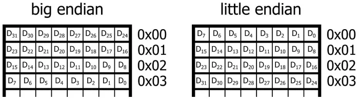

# NDS Resolver

A Rust implementation of a primitive DNS resolver inspired by [Coding challenges](https://codingchallenges.fyi/challenges/challenge-dns-resolver/).

## Usage

```Powershell
> dnsr "www.google.cz"
142.251.36.100
```

Options:
- -s, --server \<server\>: IP address of the DNS server [default: 8.8.8.8]
- -v, --verbose: Print payload

## Header

The structure of the header is defined in [RFC 1035 Section 4.1.1](https://datatracker.ietf.org/doc/html/rfc1035#section-4.1.1) and is as follows:

                                    1  1  1  1  1  1
      0  1  2  3  4  5  6  7  8  9  0  1  2  3  4  5
    +--+--+--+--+--+--+--+--+--+--+--+--+--+--+--+--+
    |                      ID                       |
    +--+--+--+--+--+--+--+--+--+--+--+--+--+--+--+--+
    |QR|   Opcode  |AA|TC|RD|RA|   Z    |   RCODE   |
    +--+--+--+--+--+--+--+--+--+--+--+--+--+--+--+--+
    |                    QDCOUNT                    |
    +--+--+--+--+--+--+--+--+--+--+--+--+--+--+--+--+
    |                    ANCOUNT                    |
    +--+--+--+--+--+--+--+--+--+--+--+--+--+--+--+--+
    |                    NSCOUNT                    |
    +--+--+--+--+--+--+--+--+--+--+--+--+--+--+--+--+
    |                    ARCOUNT                    |
    +--+--+--+--+--+--+--+--+--+--+--+--+--+--+--+--+

- ID: 16 bits: ID of the request. Set in the request and copied in the response. It is probably useful for the sender to make sense in all the requests it sends.
- QR: 1 bit: 0 for query, 1 for response. We will always set it to 0.
- OPCODE: 4 bits: Specifies the type of query. Don't understand how to use this flag.
    - 0: standard query (QUERY)
    - 1: inverse query (IQUERY)
    - 2: server status request (STATUS)
    - others unused
- AA: 1 bit: Don't know. Authoritative Answer, set in response.
- TC: 1 bit: Specifies if the message was truncated.
- RD: 1 bit: Recursion Desired. Set in query, copied in response. If set to 1 it directs the server to pursue our query recursively. That's what we want.
- RA: 1 bit: Recursion Available. Set to 1 in response, if recursion is supported by the server.
- Z: 4 bits: Not used, must be all zeroes.
- RCODE: 4 bits: Set in response.
- QDCOUNT: 16 bits: Number of entries in the question section. See below.
- ANCOUNT: 16 bits: Number of resource records in the answer section.
- NSCOUNT: 16 bits:
- ARCOUNT: 16 bits:

## Question

See [RFC 1035 Section 4.1.2](https://datatracker.ietf.org/doc/html/rfc1035#section-4.1.2). This section carries our "question". This will be the domain name whose IP address we are asking for. It contains QDCOUNT number of entries.

                                    1  1  1  1  1  1
      0  1  2  3  4  5  6  7  8  9  0  1  2  3  4  5
    +--+--+--+--+--+--+--+--+--+--+--+--+--+--+--+--+
    |                                               |
    /                     QNAME                     /
    /                                               /
    +--+--+--+--+--+--+--+--+--+--+--+--+--+--+--+--+
    |                     QTYPE                     |
    +--+--+--+--+--+--+--+--+--+--+--+--+--+--+--+--+
    |                     QCLASS                    |
    +--+--+--+--+--+--+--+--+--+--+--+--+--+--+--+--+

- QNAME: variable length: Domain name encoded as a sequence af labels. Each label consist of a length octet followed by that number of octets (these are the characters of the domain name). The domain name is terminated by a null octet. E.g. `dns.google.com` is encoded as `3dns6google3com`. So the period splits the domain name onto labels.
- QTYPE: 16 bits: This specifies the TYPE of query. What's the connection with OPCODE?
- QCLASS: 16 bits: Class of the query. Don't know.

We will set both QTYPE and QCLASS to 1.

### Label

The length label is stored in 8 bits, but the two highest bits are always 0. This means we affectively have only 6 bit labels. Maximum number of octets in a label is therefore 63. This scheme is used to distinguish labels from pointers. Pointer always starts with 11. See bellow.

## Response

The responding server sets the QR flag to 1 and indicates response type in the RCODE flag. It will also set the RA flag according to its capabilities.

The response data are concatenated to the complete query message in a form of resource record (RR).

    +---------------------+
    |        Header       |
    +---------------------+
    |       Question      | the question for the name server
    +---------------------+
    |        Answer       | RRs answering the question
    +---------------------+
    |      Authority      | RRs pointing toward an authority
    +---------------------+
    |      Additional     | RRs holding additional information
    +---------------------+

### RCODE

- 0: No error condition
- 1: Format error - The name server was unable to interpret the query.
- 2: Server failure - The name server was unable to process this query due to a problem with the name server.
- 3: Name Error - Meaningful only for responses from an authoritative name server, this code signifies that the domain name referenced in the query does not exist.
- 4: Not Implemented - The name server does not support the requested kind of query.
- 5: Refused - The name server refuses to perform the specified operation for policy reasons. For example, a name server may not wish to provide the information to the particular requester, or a name server may not wish to perform a particular operation (e.g., zone transfer) for particular data.
- 6-15: Reserved for future use

## Resource Record

Used for answer, authority and additional section (Don't know what these authority and additional sections are).

                                    1  1  1  1  1  1
      0  1  2  3  4  5  6  7  8  9  0  1  2  3  4  5
    +--+--+--+--+--+--+--+--+--+--+--+--+--+--+--+--+
    |                                               |
    /                                               /
    /                      NAME                     /
    |                                               |
    +--+--+--+--+--+--+--+--+--+--+--+--+--+--+--+--+
    |                      TYPE                     |
    +--+--+--+--+--+--+--+--+--+--+--+--+--+--+--+--+
    |                     CLASS                     |
    +--+--+--+--+--+--+--+--+--+--+--+--+--+--+--+--+
    |                      TTL                      |
    |                                               |
    +--+--+--+--+--+--+--+--+--+--+--+--+--+--+--+--+
    |                   RDLENGTH                    |
    +--+--+--+--+--+--+--+--+--+--+--+--+--+--+--+--|
    /                     RDATA                     /
    /                                               /
    +--+--+--+--+--+--+--+--+--+--+--+--+--+--+--+--+

- NAME: variable length: domain name from the question. Compression is utilized to save space and avoid repetition. See bellow.
- TYPE: 16 bits: RR type code, specifies the type of data in RDATA field. We probably expect type A with value 1 = a host address.
- CLASS: 16 bits: again, specifies the class of the data in RDATA field. Again, expect class IN (internet) with value 1.
- TTL: 32 bit unsigned integer: time (in second) the recorder can be cached for.
- RDLENGTH: 16 bit unsigned integer: the length in octets of the data in RDATA field.
- RDATA: variable length: tha data itself.

### Message Compression

Instead of repeating the domain name in the NAME field of response RR, a pointer is used to point to the domain name in the query section. The pointer takes the form of a two octet sequence:

    +--+--+--+--+--+--+--+--+--+--+--+--+--+--+--+--+
    | 1  1|                OFFSET                   |
    +--+--+--+--+--+--+--+--+--+--+--+--+--+--+--+--+

The two highest bits are always 1. OFFSET specifies offset from the start of the message. E.g. OFFSET of 0 points to the ID field in a header.

## Available DNS

- [Google public DNS](https://developers.google.com/speed/public-dns)
- [CZ.nic OTEVŘENÉ DNSSEC VALIDUJÍCÍ RESOLVERY](https://www.nic.cz/odvr/)
- [DNS4EU](https://www.joindns4.eu/)

## Endianness

The order in which bytes of multi byte variables are stored. For implementation of our NDS Resolver, we are interested in the byte (u8) order for variable of types u16.

### Terminology

- Octet: 8 bits. We can think of it a byte. Though strictly speaking 1 byte is no always equal ot 8 bits.
- MSB: Most Significant Byte
- LSB: Least Significant Byte

### Big Endian

Big endian stores the MSB at lowest memory address (sometimes we say it is stored first). Commonly used in network protocols. Also referred to as *network byte order*. If I understand this correctly it is the same way natural languages express numbers using positional system. E.g. when we read a number from left to right, we start with the most significant (biggest) digit and the magnitude of digits declines as we move to the right.

Is it correct to state: memory address increases from left to right and from top to bottom?

### Little Endian

Little endian stores the LSB at the lowest memory address. This format is used with most PCs.

### Visualization

The following image shows how 32-bit data world is stored in memory.



### Endianness on our machine

There are several ways to identify what endianness our machine uses.

```rust
if cfg!(target_endian = "big") {
    println!("Big endian");
} else {
    println!("Little endian");
}
```

To illustrate the order of bytes we can use `mem::transmute` function. This is, however, unsafe and should be avoided.

```rust
let value: u16 = 0x1234;
let bytes = unsafe { mem::transmute::<u16, [u8; 2]>(value) };
println!("Byte 0: {:02X}", bytes[0]);  // Prints: Byte 0: 34
println!("Byte 1: {:02X}", bytes[1]);  // Prints: Byte 1: 12
```

For safer way of working with multiple bytes see `to_be_bytes` and `to_le_bytes`. Or `from_be_bytes` `from_le_bytes` to create for example u16 from two u8 integers.

```rust
let value: u16 = 0x1234;
let big_endian_bytes = value.to_be_bytes();
let little_endian_bytes = value.to_le_bytes();
println!("Big endian: {:?}", big_endian_bytes);        // Prints: Big endian: [18, 52]
println!("Little endian: {:?}", little_endian_bytes);  // Prints: Little endian: [52, 18]
```

## UDP Socket in Rust

The only way to create an UDP socket using the standard `net` crate is the `net::UdpSocket::bind` method. As the name suggests, this method needs an address and a socket to bind to. Note that this is not the remote address we want to connect to. It also cannot be a localhost. This is because localhost is a co called loopback address. UDP socket bound to a loopback address can only connect to loopback addresses - in our case again to localhost.

The solution is to bind to `0.0.0.0:0` which stands for default or unspecified address. Now we can use the `net::UdpSocket::bind` method to connect ot the remote address we so desire.


## TO DO

- [ ] Check how to encode domain name ending with ".". See [Root domain on Wikipedia](https://en.wikipedia.org/wiki/Root_name_server#Root_domain).
- [ ] Finish the [Step 4](https://codingchallenges.fyi/challenges/challenge-dns-resolver/#step-4) of the challenge. Cannot send the UDP packet to the root name server at all.
- [X] Probe the number of RRs in a response in a query for "www.seznam.cz". There seem to be two RRs. Query for "www.google.cz" returns ANCOUNT of 1. Query for "rust-lang.org" returns ANCOUNT of 4!
- [ ] Handle labels in data in the `get_ip` function. It can only handle a pointer in the NAME field of an RR.
- [ ] Possibility: create `net::Ipv4Addr` object instead of string?
